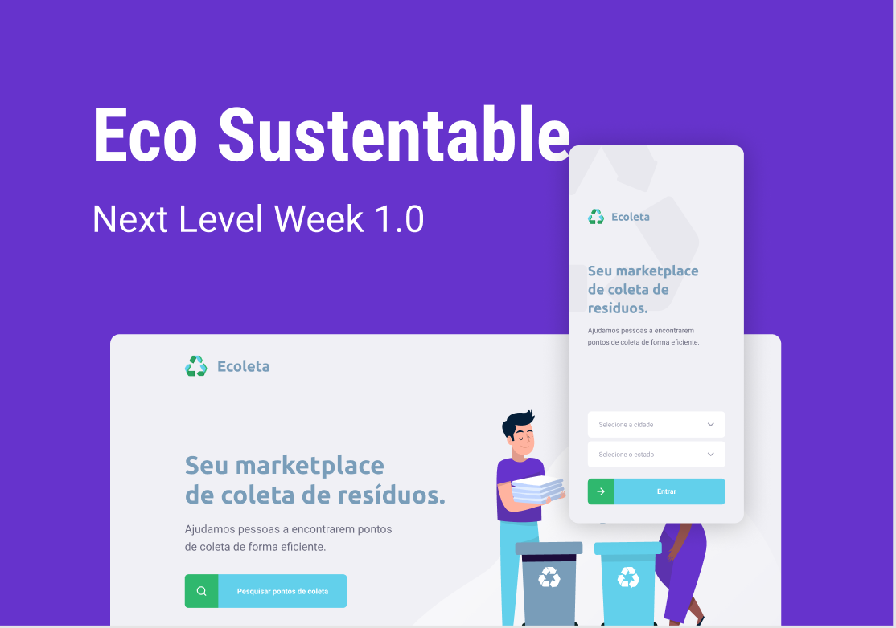

# Eco Sustentable

Next Level Week by [Rocketseat](https://rocketseat.com.br/).

An application was created that registers a data collection establishment
residues such as: cooking oil, lamps and cardboard.

We created a Rest API on the server side.

In the application the WEB is possible to register the collection point.

And in the Mobile application the person can find and view the establishments
registered.

## 🕹Project

## 📺 What I learned
React | TypeScript | React Native

## Instructions

First, if you don't have Node.js you'll need to install it:
* You can do a manual install from here: `https://nodejs.org/en/`. This will include Node and its package manager, `npm`.

* If you are on a Mac and using Homebrew you can do the following:
  + `brew install node --without-npm` (`npm` and Homebrew don't play well together)
  + `curl -L https://www.npmjs.com/install.sh | sh` (so, install `npm` separately)

Once you've got Node installed:
* `git clone git@github.com/Igorth/ecosustentable`

Server:
* `cd server`
* `npm install` to install dependencies
* `npm run dev` to start the project

Web:
* `cd web`
* `npm install` to install dependencies
* `npm start` to start the project

Mobile:
* `cd mobile`
* `npm install` to install dependencies
* `expo start` to start the project

## 👤Author

* [**Igor Dias**](https://www.linkedin.com/in/igordiasth/)

## License

This project is licensed under the MIT License - see the [LICENSE.md](LICENSE.md) file for details
